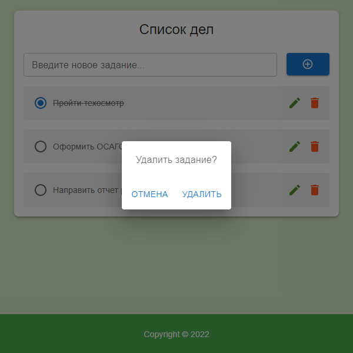

# ToDo

Классическое приложения для создания напоминаний.

## Стэк

**Frontend**: React + TypeScript + Material-UI

**Backend**: Nest.js + GraphQL + MongoDB

## Как запускать?

1. `npm run install_modules` - установка необходимых пакетов
2. `npm run launch_app` - запуск клиента и сервера

**Для успешного запуска требуются файлы переменных окружения `.env`**

Шаблоны файлов: `/.env.example`, `/server/.env.example`

Приложение работает на следующих портах:
- http://localhost:3000/  – Frontend
- http://localhost:3002/graphql  – Backend (GraphQL-сервер)

## Принтскрины

<kbd></kbd>

<kbd></kbd>

<kbd></kbd>

## Описание проекта

### Frontend

Приложение написано на функциональных компонентах React, на TypeScript. Работает с применением React Router, Redux, фреймворка Material-UI на "фронтенде". Входная точка – модуль "Авторизация" (тестовая учетная запись: логин – petrovich, пароль – givemeaccess)

### Backend

Серверная часть написана с помощью фреймворка Nest.js. API спроектировано с использованием технологии GraphQL. Используемая база данных – MongoDB.
